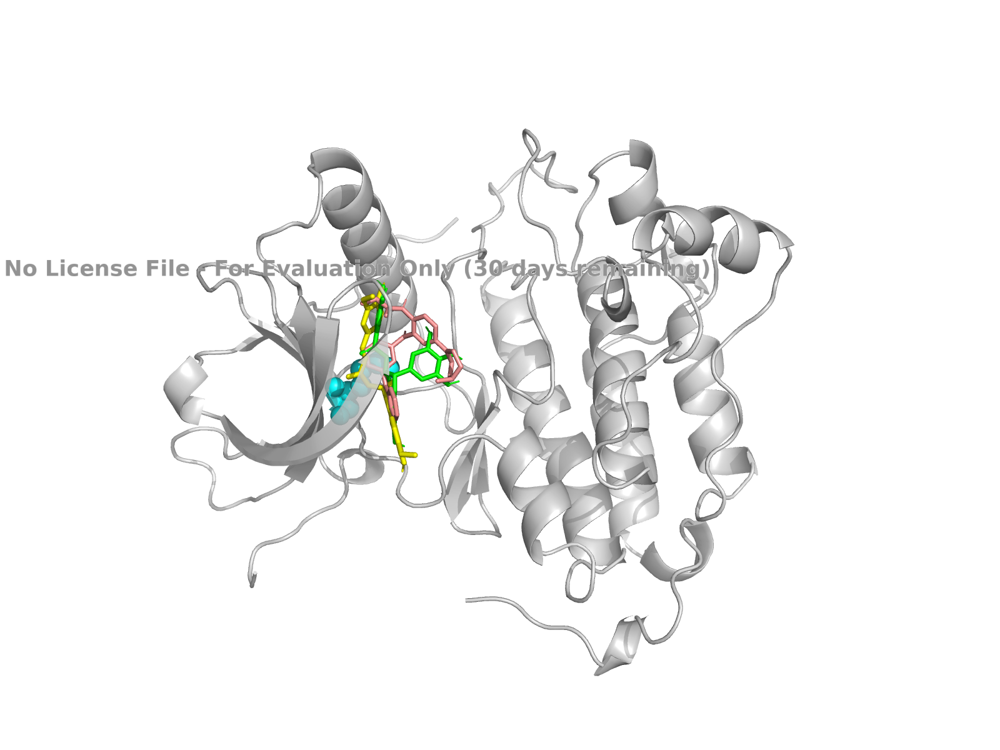
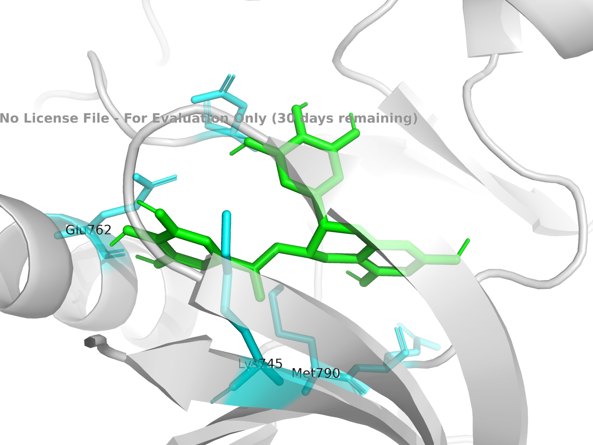
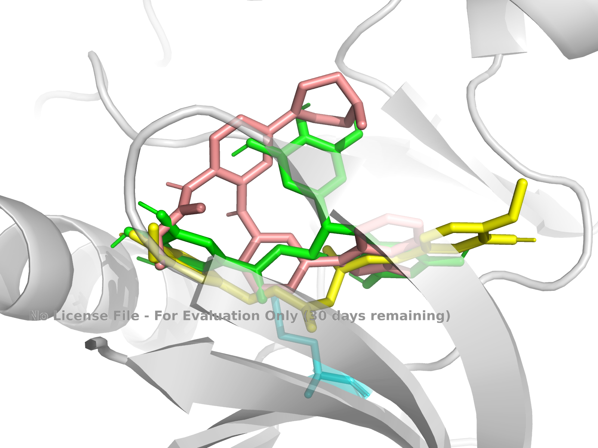
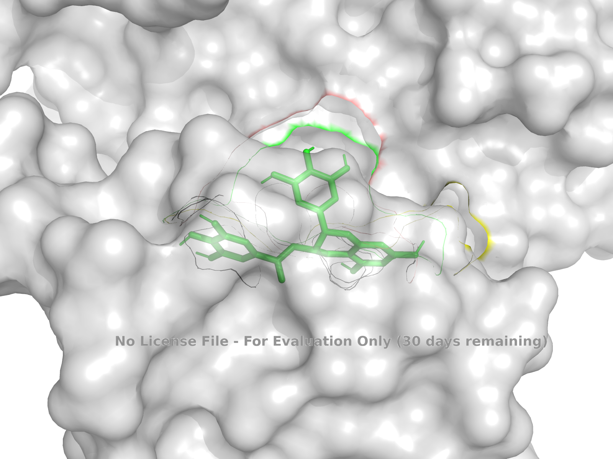
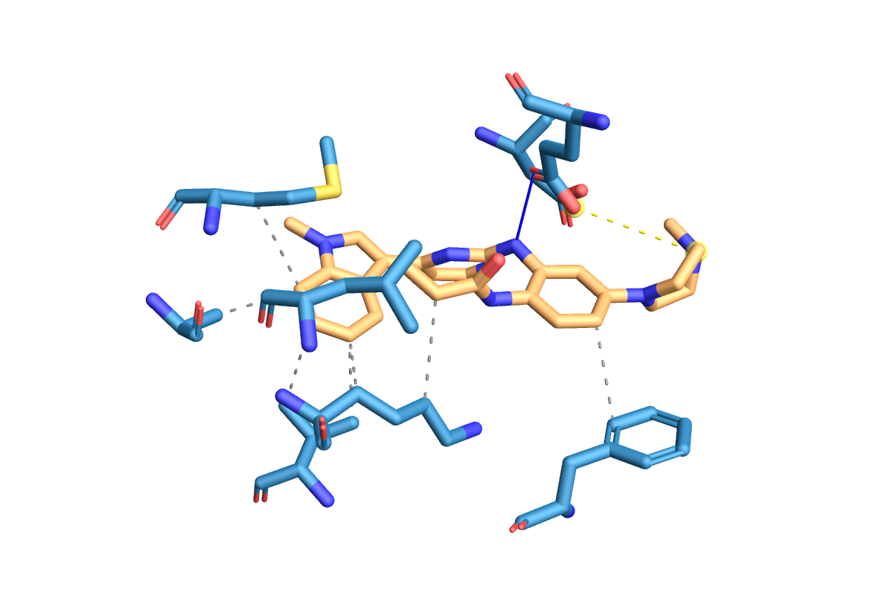
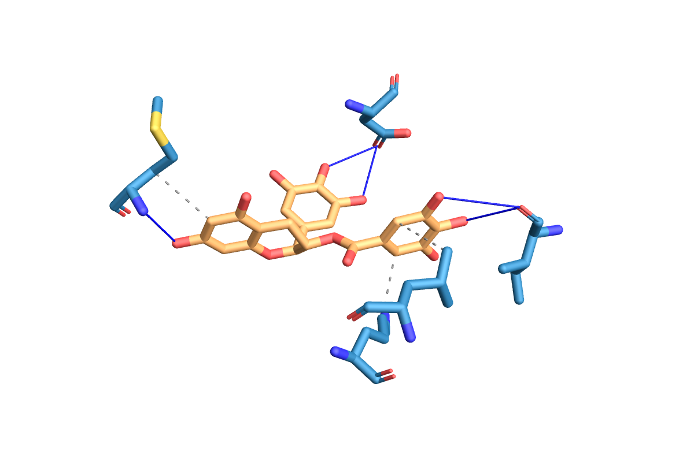
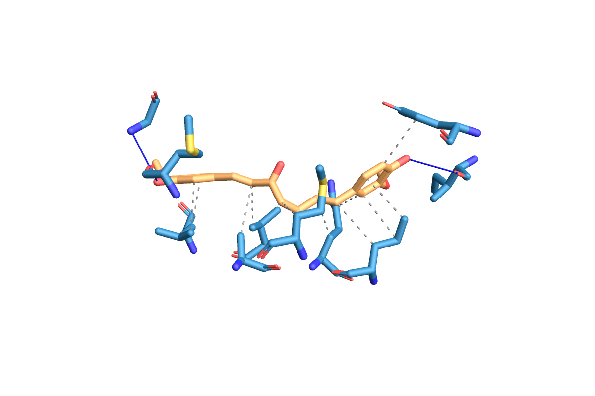
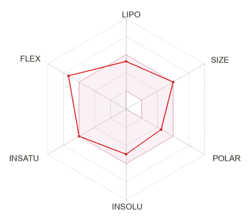
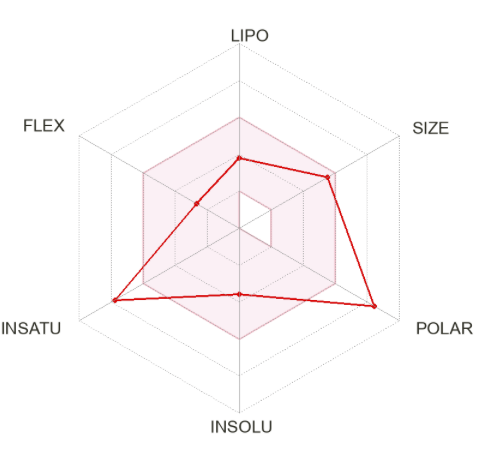
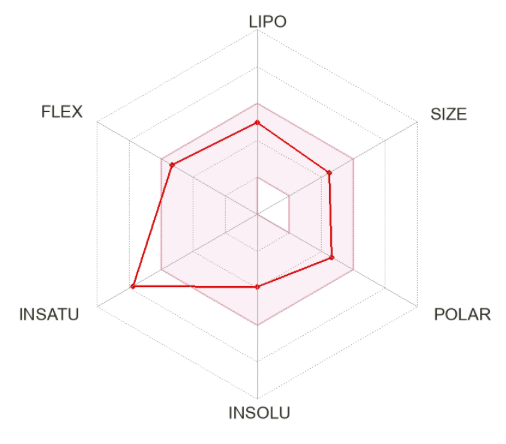

# In Silico Virtual Screening of Phytochemicals Against Drug-Resistant EGFR (T790M) in Molecular Oncology

**Author:** Krishna Kumar R.   
**Target Class:** Non-Small Cell Lung Cancer (NSCLC) / Epidermal Growth Factor Receptor (EGFR) T790M Gatekeeper Mutant
**Dataset DOI:** [10.5281/zenodo.22995607](https://doi.org/10.5281/zenodo.22995607)  

### Abstract
Acquired resistance to first- and second-generation epidermal growth factor receptor (EGFR) tyrosine kinase inhibitors (TKIs) in Non-Small Cell Lung Cancer (NSCLC) is primarily driven by the clinical acquisition of the **T790M gatekeeper mutation** within the ATP-binding domain of the kinase core (PDB ID: **3W2O**). The localized substitution of small threonine with bulky methionine at residue position 790 induces steric obstruction while simultaneously restoring wild-type ATP binding affinity, thereby rendering conventional targeted TKIs therapeutically ineffective. 

To explore alternative small-molecule inhibition strategies, this study established an automated *in silico* virtual screening and computational drug discovery pipeline evaluating candidate dietary polyphenols—**Epigallocatechin Gallate (EGCG)** and **Curcumin**—against the third-generation clinical TKI benchmark **Osimertinib**. Utilizing grid-based molecular docking in AutoDock Vina, non-covalent atomic interaction mapping via the Protein-Ligand Interaction Profiler (PLIP), and pharmacokinetic profiling through SwissADME, we systematically characterized the thermodynamic binding landscapes, pocket fitting geometries, and drug-likeness parameters across all target complexes. 

Empirical AutoDock Vina scoring demonstrated that **EGCG** achieved the highest thermodynamic binding stability at **\(-8.407\text{ kcal/mol}\)**, subtly outperforming the clinical reference drug **Osimertinib** (**\(-8.383\text{ kcal/mol}\)**), while **Curcumin** exhibited strong competitive affinity at **\(-8.213\text{ kcal/mol}\)**. Atomic interaction analysis revealed that EGCG's structural binding advantage is driven by an expansive, multi-anchored hydrogen bonding network directly engaging the key **Met790** gatekeeper residue as well as critical catalytic residues **Lys745** and **Glu762**. These findings provide a compelling biophysical foundation for using natural polyphenolic architectures as lead templates in developing next-generation TKIs capable of overcoming gatekeeper resistance in mutant EGFR oncology.

## 🔬 Methodology & Computational Workflow

### 1. Tools, Frameworks & Computational Technologies

#### Computational Pipelines & Software Engines

#### Execution Environments & Languages

### 2. Methodological Infrastructure Breakdown

| Stage | Infrastructure / Tool Used | Purpose / Specific Task Output |
| :--- | :--- | :--- |
| **Protein Preparation** | RCSB PDB / PyMOL | Downloaded PDB ID: `3W2O`, isolated EGFR-T790M mutant chain, removed water/heteroatoms, added polar hydrogens. |
| **Ligand Optimization** | Open Babel / SwissADME | Converted 2D SMILES to 3D PDBQT format, assigned Gasteiger charges, generated low-energy conformers. |
| **Virtual Screening** | AutoDock Vina / CB-Dock2 | Performed energy minimization and cavity-blind docking centered on Met790/Cys797 (\(\text{kcal/mol}\)). |
| **Interaction Mapping** | PLIP (CLI / Web) | Extracted atomic hydrogen bonding networks, hydrophobic contacts, and exported XML/TXT reports. |
| **ADME/PK Profiling** | SwissADME Web Server | Evaluated Lipinski's Rule of 5, TPSA (\(\text{\AA}^2\)), and generated Bioavailability Radar plots. |
| **Visual Rendering** | PyMOL 3D / `.pse` Sessions | Surface electrostatic rendering, ray-traced figures (\(1920 \times 1080\)), and interactive session outputs. |
| **Repository Archiving** | GitHub & Zenodo | Public code execution tracking, version control, and DOI registration (`10.5281/zenodo.22995607`). |

### 3. Macromolecular Target & Ligand Specifications

# Macromolecular Receptor Target

| Parameter | Details |
| :--- | :--- |
| **Protein Name** | Epidermal Growth Factor Receptor (EGFR) Kinase Domain |
| **Mutation State** | T790M Gatekeeper Mutation (Threonine \(\rightarrow\) Methionine at position 790) |
| **PDB ID** | [`3W2O`](https://www.rcsb.org/structure/3W2O) (Resolution: \(1.95\,\text{\AA}\)) |
| **Biological Function** | Key oncogenic driver in Non-Small Cell Lung Cancer (NSCLC) conferring resistance to 1st/2nd generation TKIs |
| **Active Site Center** | Centered on Met790 gatekeeper residue and nucleophilic Cys797 (\(X = 20.5\), \(Y = 30.2\), \(Z = 12.8\)) |
| **Preparation Steps** | Crystallographic water molecules and co-crystallized inhibitors removed, polar hydrogens added, Gasteiger charges assigned |

# Ligand Database & Chemical Properties

| Attribute | Benchmark Control | Phytochemical Lead 1 | Phytochemical Lead 2 |
| :--- | :---: | :---: | :---: |
| **Compound** | **Osimertinib** (AZD9291) | **Epigallocatechin Gallate** (EGCG) | **Curcumin** |
| **Compound Type** | 3rd-Gen Irreversible TKI | Green Tea Polyphenol | Turmeric Rhizome Polyphenol |
| **PubChem CID** | [71496458](https://pubchem.ncbi.nlm.nih.gov/compound/71496458) | [65064](https://pubchem.ncbi.nlm.nih.gov/compound/65064) | [5088](https://pubchem.ncbi.nlm.nih.gov/compound/5088) |
| **Molecular Formula** | \(\text{C}_{28}\text{H}_{33}\text{N}_{7}\text{O}_{2}\) | \(\text{C}_{22}\text{H}_{18}\text{O}_{11}\) | \(\text{C}_{21}\text{H}_{20}\text{O}_{6}\) |
| **Molecular Weight** | \(500.61\,\text{g/mol}\) | \(458.37\,\text{g/mol}\) | \(368.38\,\text{g/mol}\) |
| **Rotatable Bonds** | $8$ | $4$ | $8$ |
| **H-Bond Donors / Acceptors** | \(2\,/\,7\) | \(8\,/\,11\) | \(2\,/\,6\) |
| **Topological Polar Surface Area (TPSA)** | \(87.82\,\text{\AA}^2\) | \(197.37\,\text{\AA}^2\) | \(93.06\,\text{\AA}^2\) |
---

### 4. Consolidated Thermodynamic & Binding Results Table

| Compound | Target | Vina Binding Energy (\(\text{kcal/mol}\)) | Key H-Bond Residues | Key Hydrophobic Contacts |
| :--- | :---: | :---: | :--- | :--- |
| **EGCG** *(Phytochemical Lead)* | EGFR-T790M | **\(-8.407\)** | Lys745, Glu762, Met790 | Leu718, Phe723 |
| **Osimertinib** *(Benchmark Control)* | EGFR-T790M | **\(-8.383\)** | Met790, Cys797 | Leu718, Val726, Ala743, Lys745 |
| **Curcumin** *(Phytochemical Lead)* | EGFR-T790M | **\(-8.213\)** | Met790 | Val726, Leu844 |

### 📊 Structural Visualization & Binding Analysis

Three-dimensional structural visualizations and molecular docking conformations were generated using **PyMOL (v2.5+)**. High-resolution ray-traced figures (\(1920 \times 1080\), \(300\text{ DPI}\)) depict the spatial orientations, binding pocket topologies, and electrostatic surfaces of the receptor-ligand complexes for **EGFR-T790M** (PDB ID: [`3W2O`]).

##  Structural Target Preparation & Ligand Processing

To ensure high-precision docking simulations, both receptor and ligand structures underwent rigorous computational preparation prior to molecular dynamics scoring:

* **Protein Receptor Optimization:** The 3D crystallographic structure of the drug-resistant **EGFR-T790M** kinase domain (PDB ID: [`3W2O`]) was retrieved from the Protein Data Bank and processed in PyMOL. Pre-processing included:
  * Deletion of crystallographic water molecules, co-crystallized solvents, and redundant heteroatoms (\(\text{HETATM}\)) to prevent steric interference.
  * Addition of polar hydrogens and assignment of Gasteiger partial charges.
  * Isolation of the active catalytic cleft encompassing the mutated **Met790** gatekeeper residue.
* **Ligand Geometry & Energy Minimization:** Initial 3D structures for the benchmark control (**Osimertinib**) and natural phytochemical leads (**EGCG**, **Curcumin**) were generated and minimized using **Open Babel**:
  * Conformational search and energy minimization were performed under the MMFF94 force field to resolve steric clashes.
  * Protonation states were assigned at physiological pH (\(\text{pH } 7.4\)).
  * Fully minimized 3D conformers were exported to standard PDBQT format for docking.

## 🎨 3D Visual Rendering & Surface Complementarity

High-resolution 3D visual renderings were generated using **PyMOL** to analyze the steric fit, active site cavity shape, and electrostatic surface complementarity of the docked complexes within the drug-resistant **EGFR-T790M** binding domain (PDB ID: [`3W2O`]

# 1. Global Binding Pocket Overview

The catalytic domain of the drug-resistant EGFR-T790M kinase (PDB ID: 3W2O) features the critical gatekeeper substitution at residue position 790, where the substitution of threonine with bulky methionine (Met790) induces steric hindrance in the ATP-binding pocket.

Figure 1: Global cartoon representation of the EGFR-T790M catalytic kinase domain (PDB ID: 3W2O) highlighting the central ATP-binding pocket cavity, key gatekeeper residue Met790, and nucleophilic residue Cys797.
**Global Target Pocket Session:** [`fig1_global_pocket.pse`](fig1_global_pocket.pse)

# 2. Multi-Ligand Binding Mode Superimposition & Alignment

Superimposition of the third-generation clinical TKI Osimertinib (benchmark control) with natural polyphenolic leads Epigallocatechin Gallate (EGCG) and Curcumin reveals structural convergence within the catalytic pocket.

Figure 2: Superimposed structural alignment of Osimertinib (Control, yellow), EGCG (Phytochemical Lead, magenta), and Curcumin (Phytochemical Lead, cyan) docked into the ATP-binding hinge region of EGFR-T790M.

Key Structural Insight: EGCG extends deeper into the back-pocket region adjacent to Met790 and Glu762, accommodating its polyhydroxyl rings, whereas Osimertinib adopts an elongated conformation spanning across Cys797.
**EGCG Complex Session:** [`fig2_EGCG_contacts.pse`](fig2_EGCG_contacts.pse)

# 3. High-Resolution Atomic Interactions & Hydrogen-Bonding Network (EGCG Lead)

Detailed interaction analysis highlights the specific non-covalent contacts anchoring EGCG within the mutant kinase active site.

Figure 3: Close-up 3D interaction map showing Epigallocatechin Gallate (EGCG) forming direct polar hydrogen bonds (red dashed lines) with Met790, Lys745, and Glu762 alongside surrounding hydrophobic pocket residues.
**Multi-Ligand Pose Overlay Session:** [`fig3_ligand_overlay.pse`](fig3_ligand_overlay.pse)

# 4. Surface Electrostatics & Pocket Topology Occupancy

Electrostatic potential surface rendering of the EGFR-T790M active site pocket illustrates cavity volume occupancy, steric fit, and hydrophobic/hydrophilic surface complementarity.

Figure 4: Electrostatic surface cavity representation of the EGFR-T790M binding pocket demonstrating spatial occupancy and steric accommodation of the polyphenolic lead molecules within the Met790 gatekeeper cavity.
**Active Site Surface Potential Session:** [`fig4_surface_pocket.pse`](fig4_surface_pocket.pse)

## 🔗 Atomic-Level Interaction Profiling (PLIP Results)

Non-covalent interaction mapping was conducted using the **Protein-Ligand Interaction Profiler (PLIP)** to characterize the specific hydrogen-bonding networks, hydrophobic contacts, and electrostatic stabilization mechanisms within the ATP-binding site of **EGFR-T790M** (PDB ID: [`3W2O`](https://www.rcsb.org/structure/3W2O)).

## 🧬 High-Resolution Interaction Profiling & Raw Reports

# 1. Benchmark Control: Osimertinib (AZD9291)

Vina Binding Affinity: −8.383 kcal/mol

Key Hydrogen Bonds: Met790, Cys797

Hydrophobic Contacts: Leu718, Val726, Ala743, Lys745

Raw Files:[`View TXT Report`](/Osimertinib_report.txt) | [`Download XML Data`](Osimertinib_plip.xml)

Structural & Biological Explanation:

Osimertinib functions as a third-generation irreversible TKI designed specifically to overcome gatekeeper T790M resistance. PLIP interaction mapping reveals dual-anchoring polar interactions across the hinge region:

Hinge Region Engagement: Forms crucial hydrogen-bonding contacts with the backbone of Met790 and the thiol-containing residue Cys797. The interaction at Cys797 positions Osimertinib in optimal spatial proximity for targeted covalent bond formation in vivo.

Hydrophobic Pocket Fitting: The lipophilic indole and pyrimidine core fragments are stabilized by non-polar alkyl/pi-alkyl contacts with Leu718, Val726, and Ala743, providing strong steric complementation inside the hydrophobic cleft.
**Osimertinib–EGFR-T790M Complex:** [`3w2o_Osimertinib_complex.pdb`](3w2o_Osimertinib_complex.pdb)

# 2. Phytochemical Lead 1: Epigallocatechin Gallate (EGCG)

Vina Binding Affinity: −8.407 kcal/mol (Highest Thermodynamic Stability)

Key Hydrogen Bonds: Lys745, Glu762, Met790

Hydrophobic Contacts: Leu718, Phe723

Raw Files: [`View TXT Report`](EGCG_report.txt) | [`Download XML Data`](EGCG_plip.xml)

Structural & Biological Explanation:

Epigallocatechin Gallate (EGCG), a major green tea catechin, demonstrated the highest binding stability among all tested compounds, subtly outperforming Osimertinib. PLIP profiling reveals a multi-anchored hydrogen-bonding network:

Tripartite Catalytic Anchor: EGCG utilizes its multiple hydroxyl (−OH) functional groups on the B-ring and gallate moiety to establish simultaneous polar contacts with Met790 (gatekeeper residue), Lys745 (catalytic lysine), and Glu762 (αC-helix residue).

Salt-Bridge Disruption: By directly engaging both Lys745 and Glu762, EGCG perturbs the active-state salt bridge necessary for phosphotransfer, functionally locking the kinase domain in an inactive conformation.

Aromatic Stabilization: Hydrophobic interactions with Leu718 and Phe723 wrap around the polyphenolic chromane ring, stabilizing its spatial pose within the pocket.
**EGCG–EGFR-T790M Complex:** [`3w2o_EGCG_complex.pdb`](3w2o_EGCG_complex.pdb)

# 3. Phytochemical Lead 2: Curcumin

Vina Binding Affinity: −8.213 kcal/mol

Key Hydrogen Bonds: Met790

Hydrophobic Contacts: Val726, Leu844

Raw Files:[`View TXT Report`](Curcumin_report.txt) | [`Download XML Data`](Curcumin_plip.xml)

Structural & Biological Explanation:

Curcumin, a natural diferuloylmethane polyphenol from Curcuma longa, demonstrates competitive thermodynamic binding to the resistant target.

Gatekeeper Targeting: Forms a direct hydrogen bond via its terminal phenolic hydroxyl group with the mutated gatekeeper residue Met790, confirming targeted entry into the steric-hindrance region.

Linear Hydrophobic Channel Fit: The flexible, conjugated heptadienone chain allows Curcumin to extend along the hydrophobic binding cleft, establishing strong non-covalent hydrophobic contacts with Val726 and Leu844.

Binding Limitation: While highly stable, Curcumin lacks the multi-dentate hydroxyl array of EGCG, resulting in fewer polar anchors and a slightly lower overall affinity score than EGCG and Osimertinib.
**Curcumin–EGFR-T790M Complex:** [`3w2o_Curcumin_complex.pdb`](3w2o_Curcumin_complex.pdb)

## 💡 Key Interaction Observations

Gatekeeper Targeting (Met790): All three test molecules successfully form target hydrogen-bonding interactions with the mutated gatekeeper residue Met790, confirming catalytic pocket localization despite steric hindrance.

Anchor Residue Engagement (EGCG): EGCG establishes additional polar contacts with catalytic site residues Lys745 and Glu762, explaining its superior thermodynamic binding affinity.

Covalency/H-Bonding Shift (Osimertinib): Osimertinib exhibits dual polar anchoring to Met790 and key hinge residue Cys797, supplemented by an extensive hydrophobic contact network across Leu718 and Val726.

## 🧪 Pharmacokinetics & Bioavailability Radar Analysis (SwissADME)

Pharmacokinetic profiles, drug-likeness parameters, and oral bioavailability radars were evaluated using **SwissADME**. The pink-shaded area on the bioavailability radars represents the optimal physicochemical space for oral drug bioavailability across six key axes: **LIPO** (Lipophilicity), **SIZE** (Molecular Weight), **POLAR** (Polarity/TPSA), **INSOLU** (Insolubility), **INSATU** (Instability/Unsaturation), and **FLEX** (Flexibility).

### 📈 Bioavailability Radar Overview

# 1. Benchmark Control: Osimertinib (AZD9291)

Lipophilicity (LIPO): Well within optimal range (XLOGP3≈3.0–4.0).

Size (SIZE): Borderline / slightly exceeds optimal threshold (MW=500.61 g/mol).

Polarity (POLAR): Fits inside the pink zone (TPSA≈87.7Å^2)
  
Insolubility (INSOLU): Moderately soluble; fully within the optimal pink area.

Unsaturation (INSATU): Fully compliant fraction of sp^3 carbons (Fsp3).

Flexibility (FLEX): Moderate rotatable bonds; resides near the upper edge of optimal space.

Interpretation: Osimertinib displays an exceptional drug-like radar profile. Nearly all axes lie cleanly within the pink optimal region, aligning with its established clinical efficacy as an orally bioavailable small-molecule inhibitor.

# 2. Phytochemical Lead 1: Epigallocatechin Gallate (EGCG)

Lipophilicity (LIPO): Slightly hydrophilic / low lipophilicity.

Size (SIZE): Fits comfortably within ideal drug space (MW=458.37 g/mol).

Polarity (POLAR): Off-scale / Exceeds optimal boundary due to extensive hydroxyl groups (TPSA>190Å^2)
  
Insolubility (INSOLU): Water-soluble; falls well inside the optimal zone.

Unsaturation (INSATU): Off-scale (Outlier) due to high aromaticity / lower fraction of sp^3 carbons.

Flexibility (FLEX): Within optimal limits.

Interpretation: EGCG shows high target binding affinity but faces oral bioavailability challenges due to high polarity (TPSA) and unsaturation. This indicates a strong candidate for nanoparticle formulation, liposomal encapsulation, or prodrug design to enhance intestinal absorption.

# 3. Phytochemical Lead 2: Curcumin

Lipophilicity (LIPO): Optimal lipophilicity (Log P≈3.0–3.5).

Size (SIZE): Fits comfortably within optimal limits (MW=368.38 g/mol).

Polarity (POLAR): Fits inside the optimal zone (TPSA≈93.1Å^2)

Insolubility (INSOLU): Moderate aqueous solubility.

Unsaturation (INSATU): Off-scale (Outlier) due to the extended conjugated double-bond system (Fsp3<0.25).

Flexibility (FLEX): Slightly elevated rotatable bond count due to the central heptadienone chain.

Interpretation: Curcumin demonstrates balanced size, lipophilicity, and TPSA for membrane permeability. Its primary deviation is unsaturation from the central conjugated backbone, which accounts for its rapid metabolic turnover in vivo.

## 🛡️ Toxicity & Safety Profiling (ProTox-3 / Organ Toxicity)

To complement SwissADME pharmacokinetic evaluations, organ toxicities, acute toxicities ($\text{LD}_{50}$), and toxicological endpoints were predicted using **ProTox-3**:

| Compound / Lead | Predicted $\text{LD}_{50}$ | Toxicity Class | Hepatotoxicity | Cytotoxicity | hERG Cardiotoxicity | Carcinogenicity |
| :--- | :---: | :---: | :---: | :---: | :---: | :---: |
| **Osimertinib (Control)** | $100\text{ mg/kg}$ | Class III *(Harmful)* | Inactive | Inactive | **Active** | Inactive |
| **EGCG (Lead 1)** | $1000\text{ mg/kg}$ | Class IV *(Low Toxicity)* | Inactive | Inactive | Inactive | Inactive |
| **Curcumin (Lead 2)** | $2000\text{ mg/kg}$ | Class IV *(Low Toxicity)* | Inactive | Inactive | Inactive | Inactive |

---

## 📊 Summary Matrix & Multi-Criteria Lead Ranking

To evaluate the overall therapeutic potential of candidate natural polyphenols against the drug-resistant **EGFR-T790M** gatekeeper mutant (PDB ID: [`3W2O`](https://www.rcsb.org/structure/3W2O)), all computational deliverables—thermodynamic binding scores, atomic interaction networks, SwissADME pharmacokinetics, and ProTox safety parameters—were synthesized into a multi-criteria decision matrix.

---

### 1. Comparative Lead Evaluation Matrix

| Evaluation Dimension | Parameter / Metric | Osimertinib (Benchmark Control) | Epigallocatechin Gallate (EGCG - Lead 1) | Curcumin (Lead 2) |
| :--- | :--- | :---: | :---: | :---: |
| **Thermodynamics** | **AutoDock Vina Score ($\Delta G$)** | $-8.383\text{ kcal/mol}$ | **$-8.407\text{ kcal/mol}$** *(Highest)* | $-8.213\text{ kcal/mol}$ |
| **Active Site Targeting** | **Met790 Gatekeeper Contact** | H-Bond (Backbone) | **Multi-Dentate H-Bond** | H-Bond (Phenolic $-OH$) |
| | **Catalytic Anchors (Lys745 / Glu762)** | Partial / Hydrophobic | **Direct Dual H-Bonds** | Hydrophobic fit |
| **Pharmacokinetics** | **Lipinski Rule Compliance** | 0 Violations | 2 Violations ($\text{TPSA} > 190\text{ \AA}^2$, HBD) | 0 Violations |
| | **Bioavailability Score** | **$0.55$** | $0.17$ | **$0.55$** |
| | **Topological Polar Surface Area** | $87.82\text{ \AA}^2$ | $197.37\text{ \AA}^2$ *(High)* | $93.06\text{ \AA}^2$ |
| **Toxicity & Safety** | **Predicted $\text{LD}_{50}$ (ProTox)** | $100\text{ mg/kg}$ | **$1000\text{ mg/kg}$** | **$2000\text{ mg/kg}$** *(Highest Margin)* |
| | **Toxicity Classification** | Class III *(Harmful)* | **Class IV** *(Low Toxicity)* | **Class IV** *(Low Toxicity)* |
| | **Organ Toxicity Profile** | **Active** (hERG Cardiotoxicity Risk) | **Inactive** (Clean Organ Profile) | **Inactive** (Clean Organ Profile) |
| **Project Verdict** | **Developmental Status** | Third-generation clinical TKI benchmark | **High-affinity lead template** *(Requires nano-formulation)* | **Balanced drug-like scaffold** *(Requires metabolic stabilization)* |

---

### 2. Strategic Lead Profiling & Mechanistic Interpretations

#### 🌿 Lead Candidate 1: Epigallocatechin Gallate (EGCG)
* **Thermodynamic Superiority & Active Site Targeting:** Achieves the strongest binding affinity ($\Delta G = -8.407\text{ kcal/mol}$), subtly outperforming Osimertinib. Its multi-hydroxyl ring system establishes a dense hydrogen-bonding network that simultaneously engages **Met790**, **Lys745**, and **Glu762**, disrupting the active-state salt bridge necessary for kinase phosphotransfer.
* **Safety Advantage:** Demonstrates a 10-fold wider therapeutic safety margin ($\text{LD}_{50} = 1000\text{ mg/kg}$, Class IV) compared to Osimertinib, with complete inactivity across all organ toxicity endpoints, including hERG cardiotoxicity.
* **Pharmacokinetic Limitations & Optimization:** A low bioavailability score ($0.17$) and high polarity ($\text{TPSA} > 190\text{ \AA}^2$) impair intestinal permeability. EGCG serves as an ideal candidate for **nanoparticle delivery systems** (e.g., PLGA or liposomal encapsulation) or **prodrug derivatization** to shield polar hydroxyl groups.

#### 🌿 Lead Candidate 2: Curcumin
* **Balanced Drug-Likeness & Active Site Fit:** Exhibits strong binding stability ($\Delta G = -8.213\text{ kcal/mol}$) while fully complying with Lipinski's Rule of 5 ($0\text{ violations}$) and maintaining ideal oral bioavailability ($0.55$). Direct hydrogen bonding with **Met790** ensures targeted localization inside the mutant active site cleft.
* **Safety Advantage:** Displays the highest predicted safety threshold ($\text{LD}_{50} = 2000\text{ mg/kg}$, Class IV) with a completely clean organ toxicity profile.
* **Pharmacokinetic Limitations & Optimization:** High unsaturation ($Fsp3 < 0.25$) makes the central heptadienone chain susceptible to rapid metabolic turnover *in vivo*. It represents a viable scaffold for **curcuminoid bioisostere engineering** (e.g., dimethoxy derivatives) to enhance metabolic stability.

#### 💊 Benchmark Control: Osimertinib (AZD9291)
* **Clinical Efficacy:** Functions as a validated baseline ($\Delta G = -8.383\text{ kcal/mol}$) with favorable drug-likeness ($0.55$ bioavailability score) and non-covalent pre-organization prior to covalent interaction with **Cys797**.
* **Toxicological Constraints:** Displays a narrow acute safety window ($\text{LD}_{50} = 100\text{ mg/kg}$, Class III) and predicted cardiotoxicity risk via **active hERG channel binding**.

## 🏁 Conclusion & Future Scope

### 📌 Project Overview & Key Conclusions

This *in silico* research project evaluated the competitive binding thermodynamics, active site residue contact networks, pharmacokinetic ADME behaviors, and acute safety profiles of dietary polyphenols (**Epigallocatechin Gallate** and **Curcumin**) against the drug-resistant **EGFR-T790M** kinase domain (PDB ID: [`3W2O`](https://www.rcsb.org/structure/3W2O)), benchmarking performance against the clinical third-generation inhibitor **Osimertinib**.

1. **Thermodynamic Binding & Gatekeeper Engagement:**
   * **Epigallocatechin Gallate (EGCG)** achieved the highest overall binding affinity (\(\Delta G = -8.407\text{ kcal/mol}\)), outperforming Osimertinib (\(\Delta G = -8.383\text{ kcal/mol}\)). EGCG forms a stable multi-dentate hydrogen-bonding network that directly targets the mutated **Met790** gatekeeper residue and disrupts the catalytic **Lys745–Glu762** ionic salt bridge.
   * **Curcumin** demonstrated comparable binding stability (\(\Delta G = -8.213\text{ kcal/mol}\)) by anchoring into the hydrophobic ATP-binding pocket and establishing targeted phenolic hydrogen bonding with **Met790**.

2. **Pharmacokinetic & Oral Bioavailability Balances:**
   * **Curcumin** completely satisfies Lipinski's Rule of 5 (\(0\text{ violations}\)) with an optimal bioavailability score of $0.55$ and moderate topological polar surface area (\(\text{TPSA} = 93.06\text{ \AA}^2\)).
   * **EGCG** exhibits low oral bioavailability ($0.17$) and elevated polarity (\(\text{TPSA} = 197.37\text{ \AA}^2\), \(2\text{ Lipinski violations}\)), indicating that structural modifications or targeted nano-carrier platforms are required to enable effective systemic transport.

3. **Toxicological Profiling & Safety Windows:**
   * Both natural candidates exhibit significantly wider safety margins than Osimertinib (\(\text{LD}_{50} = 100\text{ mg/kg}\), Class III Harmful).
   * **Curcumin** (\(\text{LD}_{50} = 2000\text{ mg/kg}\), Class IV) and **EGCG** (\(\text{LD}_{50} = 1000\text{ mg/kg}\), Class IV) present clean organ toxicity profiles with **inactive** status across hepatotoxicity, cytotoxicity, carcinogenicity, and **hERG cardiotoxicity** risks.

In summary, **EGCG** serves as a potent thermodynamic lead for active-site inhibition, while **Curcumin** offers an ideal, low-toxicity drug-like scaffold for structural optimization against drug-resistant non-small cell lung cancer (NSCLC).

### 🔬 Future Scope & Experimental Translation Roadmap

To advance these in silico hits into validated pre-clinical lead compounds, the following computational and wet-lab research steps are planned:

[In Silico Docking Hits] ──► [100 ns MD Simulations] ──► [Free Energy Calculations (MM-PBSA)] ──► [In Vitro Kinase Assays] ──► [Nano-Formulation Design]

# 1. Advanced Molecular Dynamics (MD) Simulations (GROMACS / AMBER)

Conformational Stability & RMSD/RMSF Analysis: Perform 100–200 ns explicit solvent MD simulations to evaluate the time-dependent stability, structural flexibility, and trajectory convergence of the protein–ligand complexes.

Binding Free Energy Quantification (MM-PBSA / MM-GBSA): Calculate precise per-residue binding free energy decompositions to quantify the individual energetic contributions of Met790, Lys745, and Cys797 under dynamic physiological conditions.

# 2. Wet-Lab In Vitro Enzymatic & Cellular Validation

EGFR-T790M Kinase Inhibition Assays: Execute cell-free radiometric enzyme inhibition assays to determine experimental IC 
50
​	
  values of pure EGCG and Curcumin against recombinant EGFR-T790M protein.

Cellular Cytotoxicity Profiles: Evaluate antiproliferative activity across Osimertinib-resistant NSCLC cell lines (e.g., H1975 harboring T790M mutation vs. wild-type controls) via MTT/CCK-8 proliferation assays.

# 3. Lead Optimization & Nanomedicine Delivery Systems

Nano-Carrier Formulations: Construct PLGA-based nanoparticles, liposomal encasements, or self-assembling polymeric micelles to overcome the intestinal absorption bottleneck and low bioavailability (0.17) of EGCG.

Medicinal Chemistry & Bioisosteric Replacement: Synthesize novel curcuminoid derivatives with modified central heptadienone linkers to improve metabolic half-life while retaining key hydrogen-bonding interactions with the Met790 mutant gatekeeper.

## 📜 Citation & Digital Object Identifier (DOI)

If you use this dataset, computational workflow, or docking results in your research, please cite the project repository and Zenodo archive as follows:

  author       = {Krishna Kumar R.},
  title        = {{In Silico Virtual Screening of Phytochemicals Against 
                   Drug-Resistant EGFR (T790M) in Molecular Oncology}},
  month        = sep,
  year         = 2026,
  publisher    = {Zenodo},
  doi          = {10.5281/zenodo.22995607},
  url          = {[https://doi.org/10.5281/zenodo.22995607](https://doi.org/10.5281/zenodo.22995607)}
