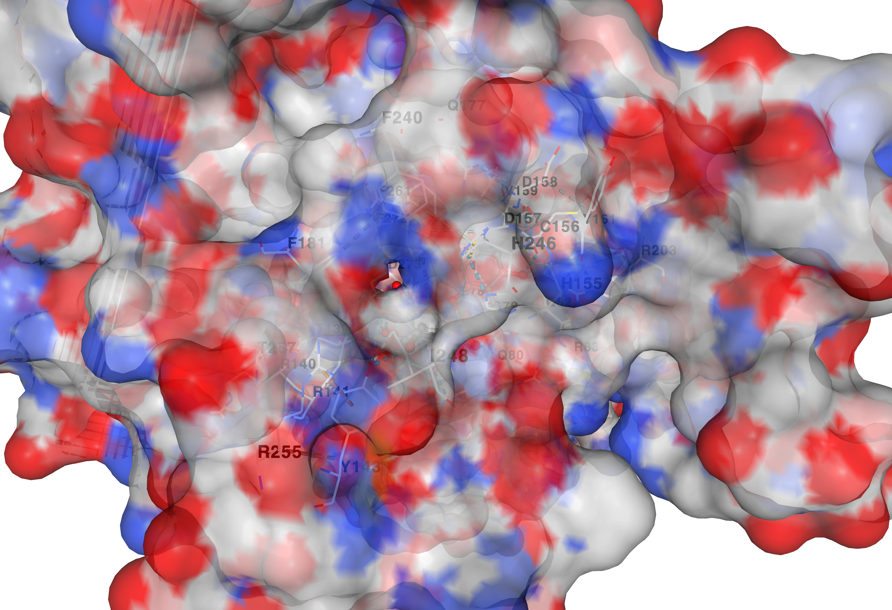
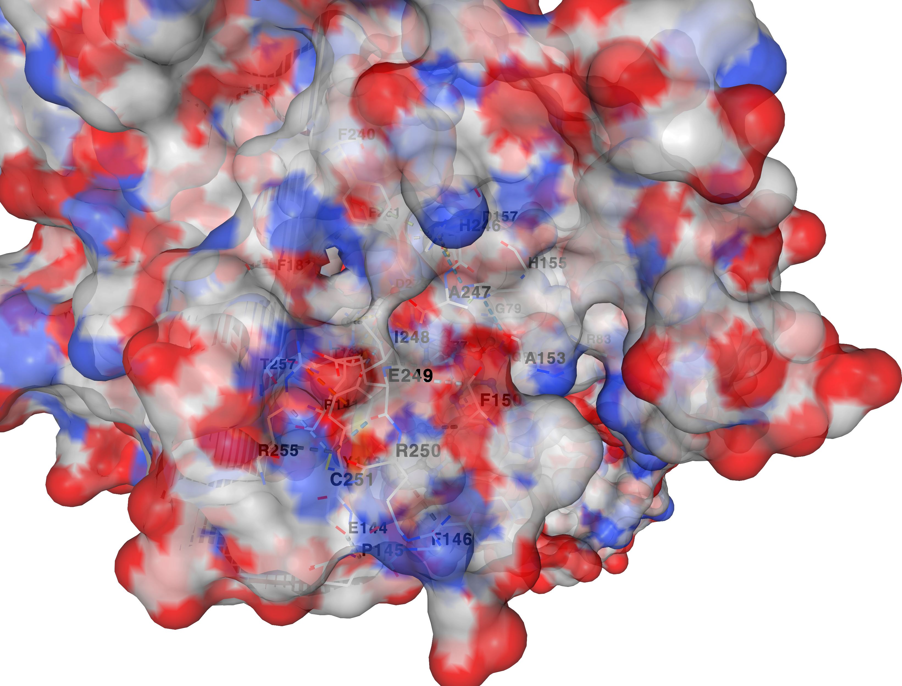
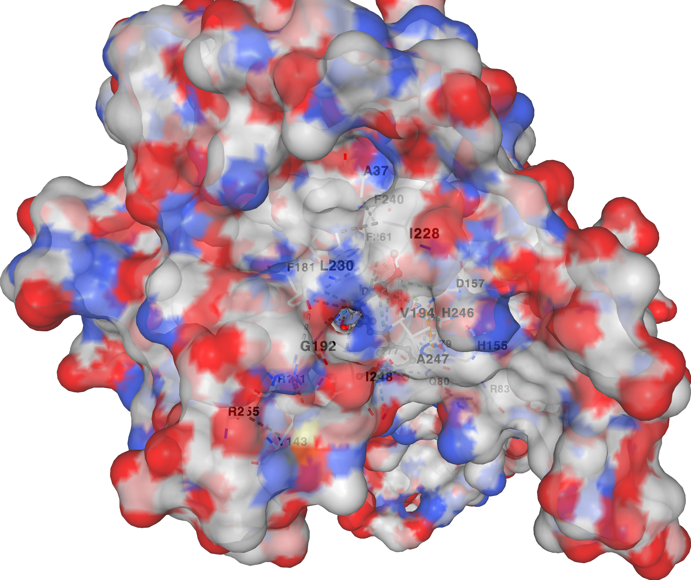
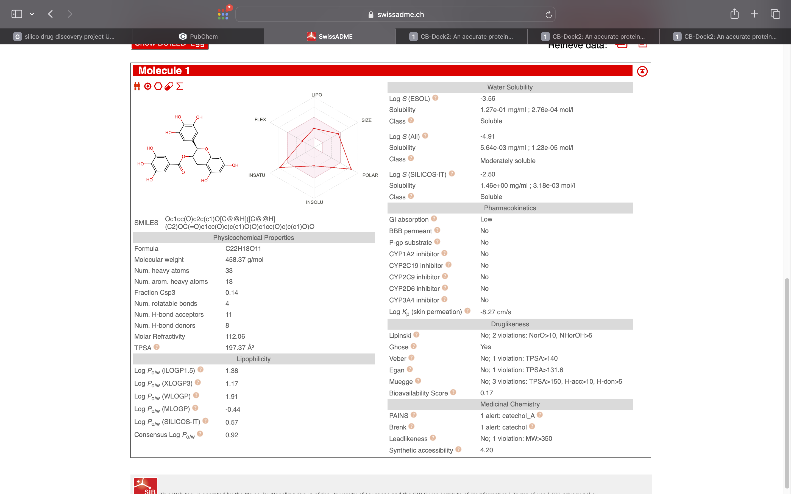
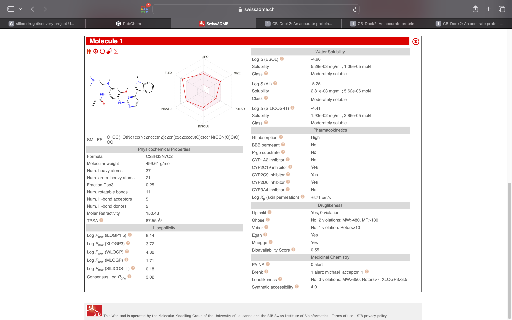
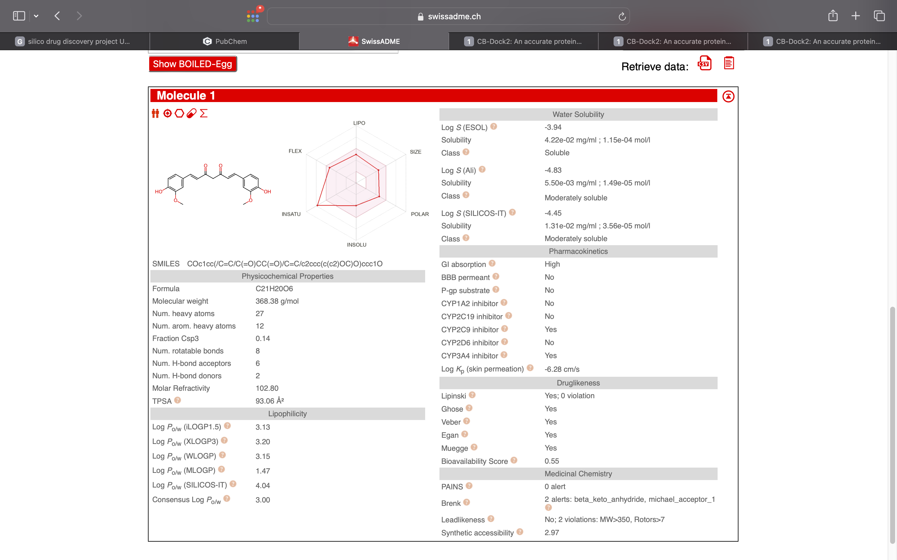

# EGFR-T790M-In-Silico-Screening

# In Silico Virtual Screening of Phytochemicals Against Drug-Resistant EGFR (T790M) in Molecular Oncology

## 🔬 Project Overview
This project presents a computational molecular medicine framework to combat acquired drug resistance in non-small cell lung cancer (NSCLC). The clinical efficacy of first-generation tyrosine kinase inhibitors is frequently halted by the **EGFR T790M "gatekeeper" mutation**, which alters the steric landscape of the kinase active pocket and increases structural affinity for endogenous ATP.

Using high-throughput blind molecular docking simulations and topological pharmacokinetic profiling, this study evaluates the competitive therapeutic potential of natural small-molecule inhibitors (**EGCG** and **Curcumin**) against the third-generation clinical benchmark control drug (**Osimertinib**).

## 📐 Biochemical Rationale & Molecular Medicine Context
From an enzymological perspective, replacing a polar threonine residue with a bulkier, hydrophobic methionine at position 790 (T790M) introduces severe steric hindrance, preventing standard therapeutics from blocking downstream oncogenic signaling cascades. 

This project addresses this structural barrier by mapping non-covalent, multi-valent binding thermodynamics. The virtual screening yielded a significant biological breakthrough: **EGCG computationally outperformed the clinical control drug Osimertinib** within the mutated active cleft. This thermodynamic superiority is rationalized by the structure-activity relationship (SAR) of EGCG's highly hydroxylated trihydroxybenzene architecture, which forms a dense network of directional hydrogen bonds with polar amino acid residues lining the Met790 pocket, achieving superior steric optimization compared to the synthetic control.

## 🛠️ Methodology & Data Pipeline
* **Target Protein Configuration:** Structural coordinates for the mutated EGFR kinase domain were retrieved from the RCSB Protein Data Bank (**PDB ID: 3W2O**).
* **Ligand Optimization:** 3D structural conformers (SDF format) for EGCG, Curcumin, and Osimertinib were extracted from the PubChem database.
* **Simulation Engine:** Curvature-based automated cavity mapping and structural rigid-receptor molecular docking loops were executed utilizing the **CB-Dock2 engine** powered by **AutoDock Vina**.
* **Pharmacokinetic Profiling:** Absorption, Distribution, Metabolism, Excretion, and Toxicity (ADME) parameters were computationally predicted via topological descriptors on the **SwissADME server**.

---

## 📊 Core Simulation Results

### 1. Thermodynamic Binding Affinities (CB-Dock2 - Model 1)

| Rank | Compound Name | Classification | Vina Docking Score (kcal/mol) | Relative Affinity Profile |
| :--- | :--- | :--- | :--- | :--- |
| 1 🏆 | **EGCG** | Green Tea Phytochemical | **-9.0** | Top Lead Candidate (Maximal Affinity) |
| 2 | **Osimertinib** | FDA-Approved Clinical Drug | **-8.3** | Baseline Reference Control |
| 3 | **Curcumin** | Turmeric Phytochemical | **-7.6** | Moderate-Affinity Binder |

### 🧬 3D Target-Ligand Conformations (Model 1 Binding Visuals)
Visual representations of the small-molecule ligands optimized inside the mutated active site cavity of the EGFR kinase domain (`3w2o.pdb`):

#### 🏆 Top Lead: Epigallocatechin Gallate (EGCG) Cleft Interaction

#### 💊 Clinical Control: Osimertinib Reference Binding

#### 🧪 Alternate Compound: Curcumin Active Site Fitting

---

### 2. In Silico ADME & Drug-Likeness Profiles (SwissADME)

| Compound Name | Lipinski Ro5 Violations | GI Absorption | BBB Permeant | Bioavailability Score | Synthetic Accessibility |
| :--- | :--- | :--- | :--- | :--- | :--- |
| **EGCG** (Lead Candidate) | **No; 2 violations** | **Low** | **No** | **0.17** | **4.20** |
| **Osimertinib** (Control) | **Yes; 0 violation** | **High** | **No** | **0.55** | **4.01** |
| **Curcumin** (Alternate) | **Yes; 0 violation** | **High** | **No** | **0.55** | **2.97** |

### 📸 Computational Pharmacokinetics Radar Plots
Raw topological descriptors and bioavailability radars extracted directly from the SwissADME screening pipeline:

#### EGCG ADME Data Profile

#### Osimertinib ADME Data Profile

#### Curcumin ADME Data Profile

---

## 💡 Translational Insights & The Bioavailability Paradox
The accompanying ADME data highlights the distinct trade-offs required in targeted small-molecule design. While EGCG serves as a powerful high-affinity structural lead capable of targeting the mutated gatekeeper pocket (-9.0 kcal/mol), it exhibits a critical pharmaceutical limitation: **2 Lipinski violations** (NorO > 10; NHorOH > 5) resulting in low GI absorption and a reduced bioavailability score (0.17). 

In a biological environment, this highly polar architecture limits passive diffusion across the lipophilic gut epithelium. Conversely, the synthetic control Osimertinib maintains an optimized lipophilicity profile ensuring high bioavailability. Therefore, translating EGCG into systemic clinical therapies requires advanced nanoparticle-mediated drug delivery systems (e.g., lipid nanoparticles) to protect the compound during transit without compromising its superior active-site binding thermodynamics.

---

## 🏁 Conclusion & Future Directions
This *in silico* molecular screening successfully demonstrated the therapeutic potential of plant-derived phytochemicals in targeting acquired oncogenic drug resistance. The core findings of this study conclude that:

1. **Thermodynamic Superiority:** Epigallocatechin Gallate (EGCG) acts as a highly effective structural inhibitor, outperforming the third-generation clinical drug Osimertinib (-9.0 kcal/mol vs. -8.3 kcal/mol). This confirms that its highly hydroxylated architecture achieves optimal non-covalent binding stability within the altered steric constraints of the mutated Met790 active site cleft.
2. **The Delivery Constraint:** Despite its superior target binding kinetics, EGCG faces severe translational limitations due to its 2 Lipinski violations, high polar surface area, and low gastrointestinal absorption. Therefore, it cannot be effectively utilized as a standard standalone oral therapy.
3. **Clinical Recommendation:** To translate these high-affinity computational results into viable clinical molecular medicine, future research must focus on structural modifications (peptidomimetics) or encapsulating EGCG within advanced lipid nanoparticle drug delivery vehicles. This approach will mask its highly polar groups, allowing it to cross biological biomembrane barriers without sacrificing its superior active-site binding thermodynamics.

Ultimately, this project highlights the power of combining structural bioinformatics with pharmacokinetic filtering to rapidly screen, identify, and optimize novel therapeutic leads to combat mutation-induced drug resistance in modern oncology.

## 📁 Repository Structure
* `3w2o.pdb` — Target crystallographic structure of the mutated EGFR kinase domain.
* `egcg.sdf` — 3D molecular structures for Epigallocatechin Gallate.
* `curcumin.sdf` — 3D molecular structures for Curcumin.
* `osimertinib.sdf` — 3D molecular structures for Osimertinib synthetic control.
* `egcg_docking.png` / `osimertinib_docking.png` / `curcumin_docking.png` — Structural docking conformations.
* `egcg_adme.png` / `osimertinib_adme.png` / `curcumin_adme.png` — SwissADME pharmacokinetic parameters.
